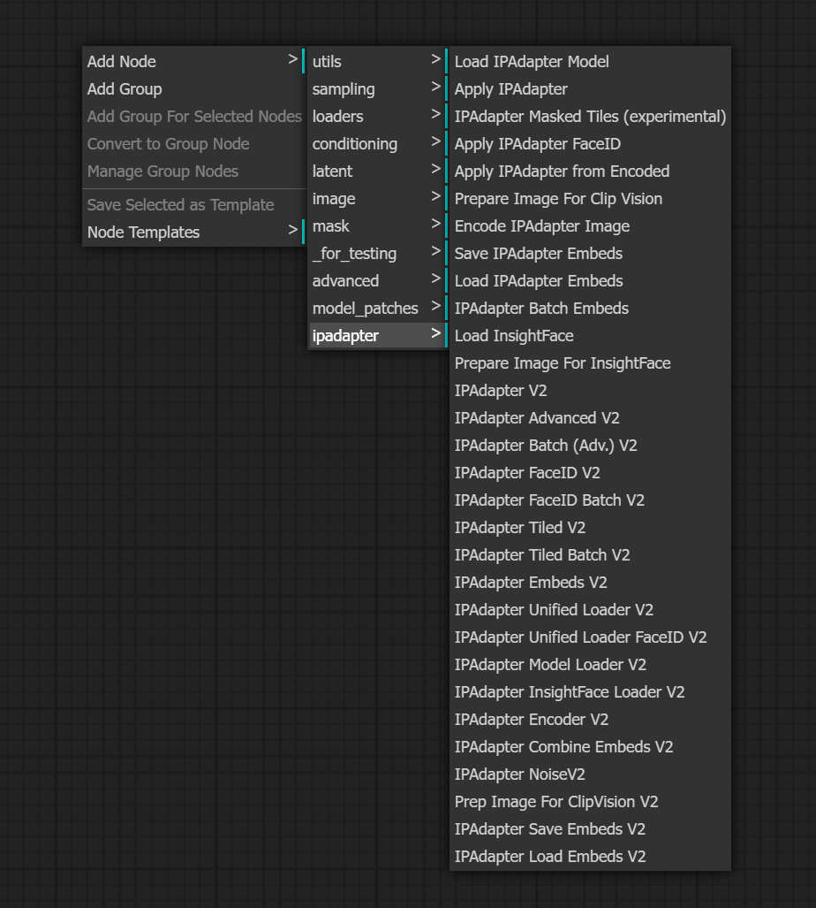

# ComfyUI IPAdapter plus V2

A copy of [ComfyUI_IPAdapter_plus](https://github.com/cubiq/ComfyUI_IPAdapter_plus), Only changed node name to coexist with ComfyUI_IPAdapter_plus v1 version.    

Thanks to author [Cubiq](https://github.com/cubiq)'s great work, Please support his original work.

The copy of latest ComfyUI_IPAdapter_plus V1 version is saved on [GoogleDrive](#https://drive.google.com/drive/folders/1DAcDzKcypm3mKH3yjyM2c07b3XqqM07P?usp=sharing) or [BaiduNetdisk](#https://pan.baidu.com/s/1x_SVJIhEzBbENGrlonvtgw?pwd=86gf).    
